# Ten Simple Steps to setup Python 3 and Jupyter Lab

This tutorial describes step by step how to setup Jupyter Lab for Python 3 on Windows 10 and Mac OS.

## 1. Download Miniconda
Click on the latest version (Python 3.9) for your operating system (e.g., Miniconda3 Windows 64-bit) to download the installer.
<p align="center">
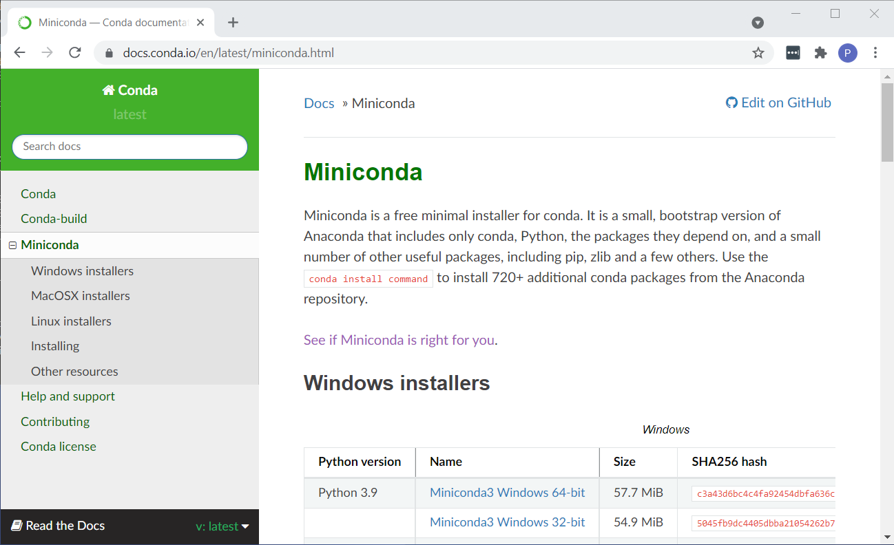
</p>

## 2. Install Miniconda3
Run the Miniconda3 installer (shown here is the installer for Windows 10) by following these steps.
<p align="center">
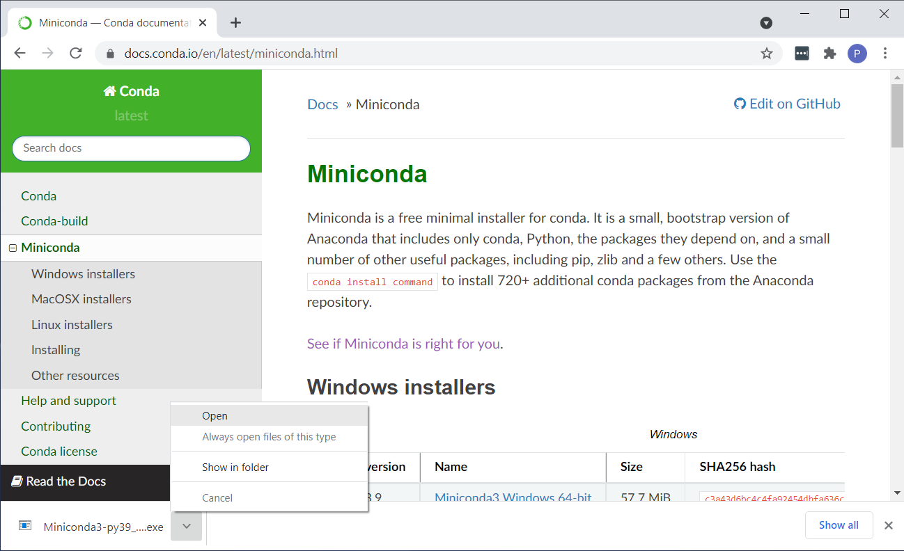
</p>

Click Next.
<p align="center">
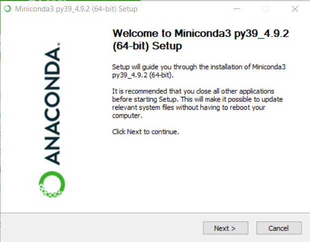
</p>
Click I Agree.
<p align="center">
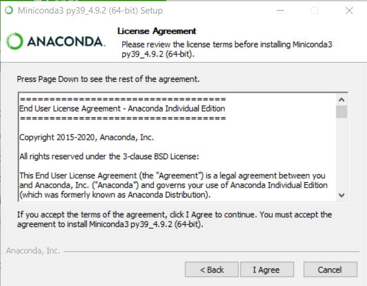
</p>
Click Next.
<p align="center">
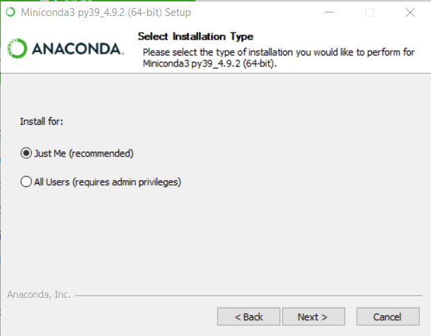
</p>
Click Next.
<p align="center">
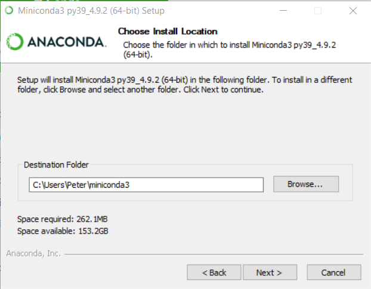
</p>

**IMPORTANT**, select the option "Add Miniconda 3 to my PATH environment Variable" and click "Install"
<p align="center">
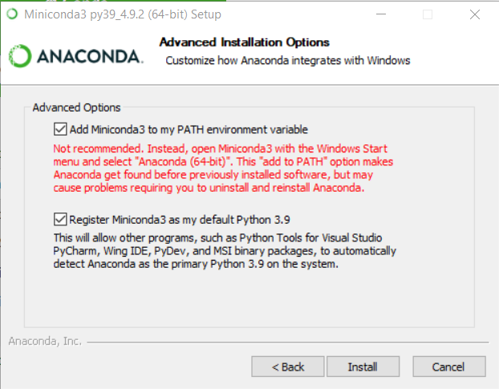
</p>
Click Next.
<p align="center">
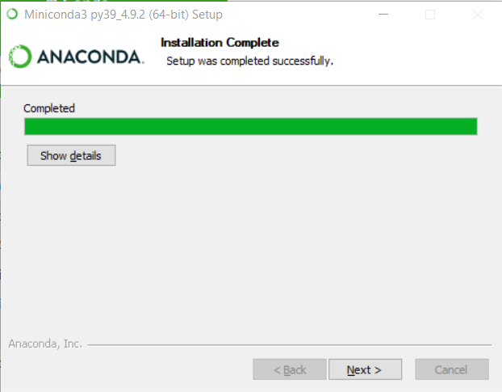
</p>
</p>

Finally, click finish to complete the installation of Miniconda3.
<p align="center">
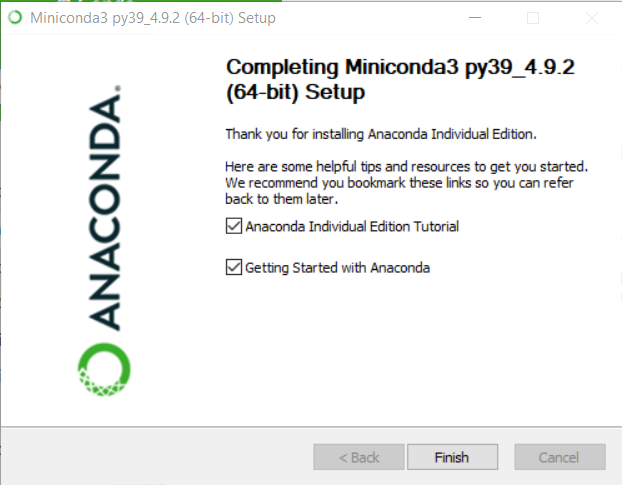
</p>

## 4. Open a Command Window/Terminal Window

#### On Window 10

Type "cmd" in the Windows search bar to open a command window.
<p align="center">
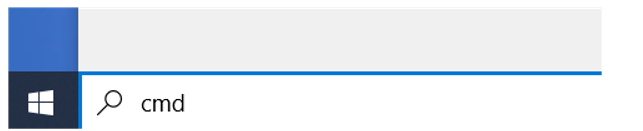
</p>

#### On Mac OS

Type "terminal" in the Spotlight Search in top menu bar to open a terminal window.
<p align="center">
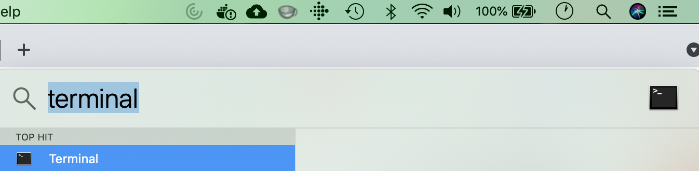
</p>

## 5. Install Jupyter Lab using Conda

Type the following command into the command window to install Jupyter Lab.

```conda install -c conda-forge jupyterlab```

 Type "y" to proceed when prompted to complete the installation.

<p align="center">
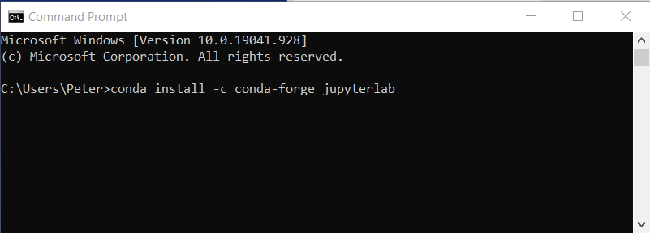
</p>

## 6. Install Pandas using Conda

Type the following command into the command window to install Pandas. 

```conda install -c conda-forge pandas```

Type "y" to proceed when prompted to complete the installation.

<p align="center">

</p>

## 7. Create a Directory for the Python Tutorials

Type the following command into the command window to create a new directory.

```mkdir tutorial```
<p align="center">
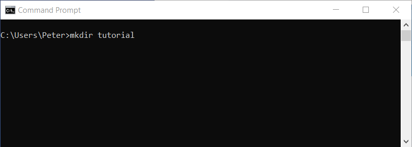
</p>

## 8. Run Jupyter Lab

Type the following commands to run Jupyter Lab in the tutorial directory.
```
cd tutorial
jupyter lab

```
<p align="center">
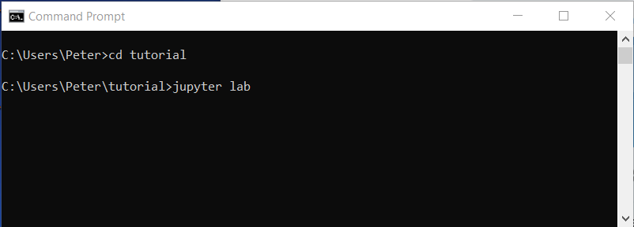
</p>

Jupyter Lab will launch in your default web browser.
<p align="center">
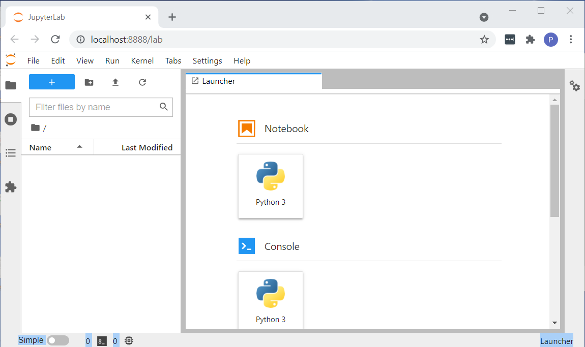
</p>

## 9. Create a new Notebook 
Select "New -> Notebook" from the File menu.
<p align="center">
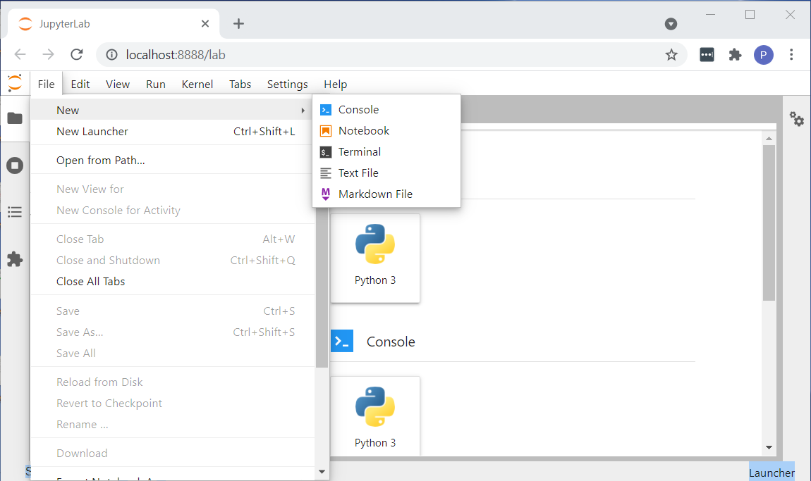
</p>

Select "Python 3" as the Kernel.
<p align="center">
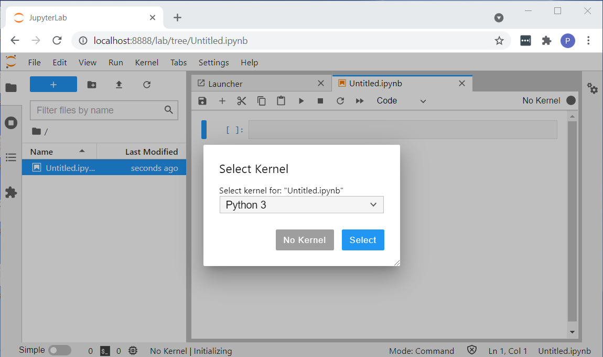
</p>

Select "Rename" from the file menu and rename the notebook: ```tutorial1.ipynb```.

## 10. Run a simple Python command in the Notebook
Type ```print('Hello World')``` in the first notebook cell.
<p align="center">
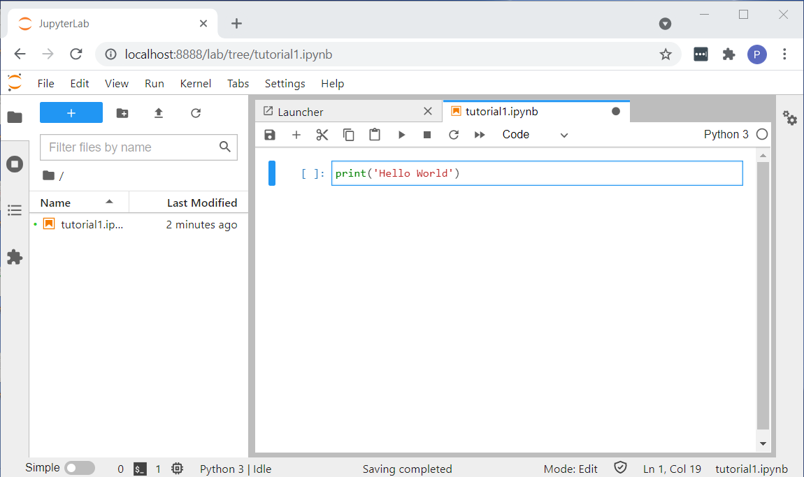
</p>

Click the run (>) button to execute your first Python command. Make sure the cell you want run is selected. This command will print the text ```Hello World```.

<p align="center">
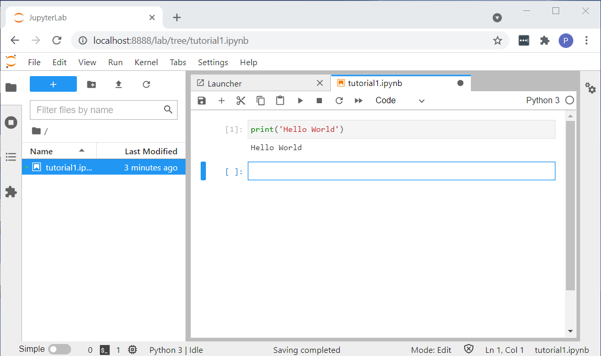
</p>

Lets add a couple of numbers and print the results. In the second cell, type:
```
x = 5
y = 7
z = x + y
print(z)
```
and click the run (>) button again to see the result.
<p align="center">
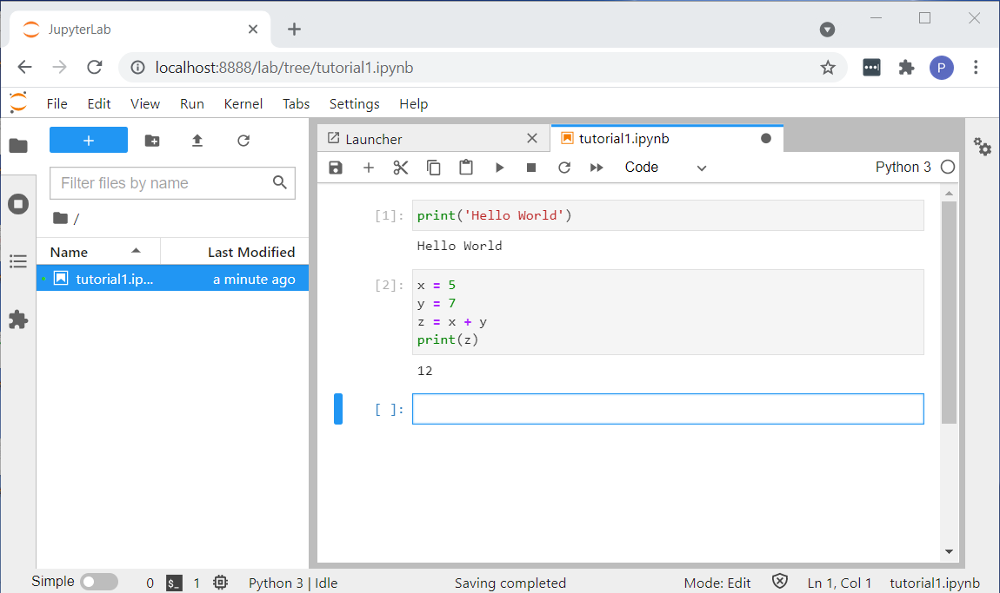
</p>

Congratulations, you've run your first Python code in Jupyter Lab.

Select "Shutdown" from the File menu when you are finshed with your first tutorial.
<p align="center">
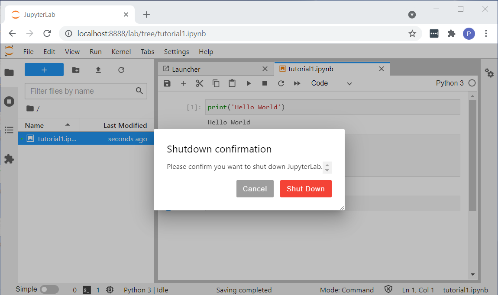
</p>

To start Jupyter Lab again, go to step 8, create new notebooks and follow the same steps.

Now you are ready to learn Python!


# Basic Python Tutorials
Now, that you have setup Python and Jupyter Notebook, let's learn the basics of Python. Corey Schafer has created an excellent series of [YouTube videos](https://www.youtube.com/channel/UCCezIgC97PvUuR4_gbFUs5g).

Run these tutorials in Jupyter Notebooks. Create a new notebook for each tutorial (tutorial2, tutorial3,...). 

For each new topic in a tutorial, create a new cell by clicking the ```+``` sign in the menu at the top of the notebook.

* Python Tutorial for Beginners 2: [Strings - Working with Textual Data](https://www.youtube.com/watch?v=k9TUPpGqYTo)

* Python Tutorial for Beginners 3: [Integers and Floats - Working with Numeric Data](https://www.youtube.com/watch?v=khKv-8q7YmY)

* Python Tutorial for Beginners 4: [Lists, Tuples, and Sets](https://www.youtube.com/watch?v=W8KRzm-HUcc)

* Python Tutorial for Beginners 5: [Dictionaries - Working with Key-Value Pairs](https://www.youtube.com/watch?v=daefaLgNkw0)

* Python Tutorial for Beginners 6: [Conditionals and Booleans - If, Else, and Elif Statements](https://www.youtube.com/watch?v=DZwmZ8Usvnk)

* Python Tutorial for Beginners 7: [Loops and Iterations - For/While Loops](https://www.youtube.com/watch?v=6iF8Xb7Z3wQ)

# Basic Pandas Tutorials
Pandas is a Python library for data analysis. It works with tabular data, such as Excel files (.xlsx) or comma separated value files (.csv). Pandas refers to tabular data as dataframes.

Run the tutorials in Jupyter Lab. 

**NOTE, We'll skip the first 3 minutes of the first video which covers the installation of Pandas and Jupyter Lab. You have already installed them earlier, so do not install them again. We'll start the video with loading data into Pandas**

* Python Pandas Tutorial (Part 1): [Getting Started with Data Analysis - ~~Installation and~~ Loading Data](https://www.youtube.com/watch?v=ZyhVh-qRZPA&t=178s)</br>
The data files used in this video can be downloaded from the StackOverflow Survey [download page](https://insights.stackoverflow.com/survey)

* Python Pandas Tutorial (Part 2):[DataFrame and Series Basics - Selecting Rows and Columns](https://www.youtube.com/watch?v=zmdjNSmRXF4)

* Python Pandas Tutorial (Part 3): [Indexes - How to Set, Reset, and Use Indexes](https://www.youtube.com/watch?v=W9XjRYFkkyw)


